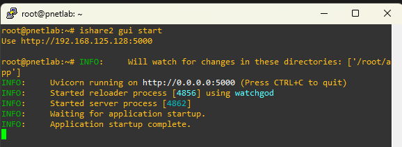
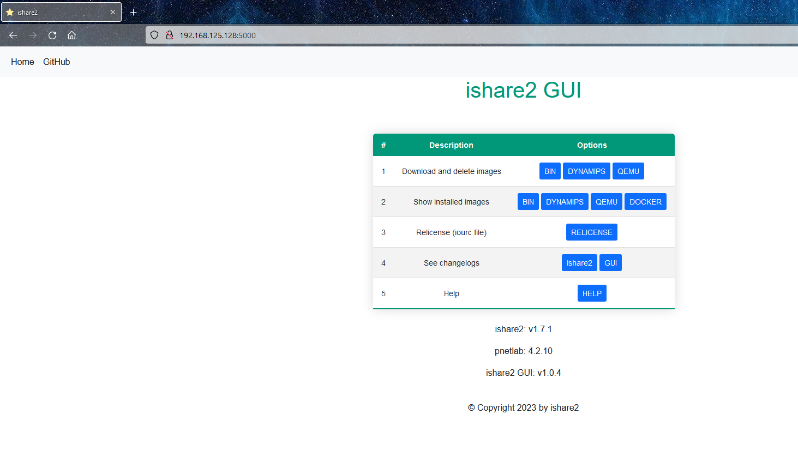
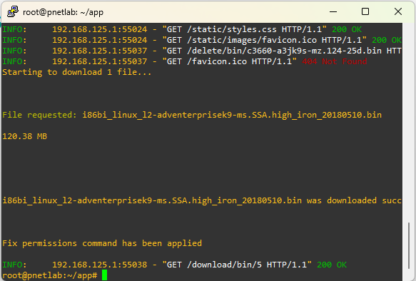

# Instalando imagenes de dispositivos usando ishare2

El primer paso es tener instalado el [ishare2](https://github.com/pnetlabrepo/ishare2) como se dio en el laboratorio.

Usaremos el comando "ishare2 gui start" para descargar y lanzar el miniservidor para la interfaz gráfica.

Una vez esté corriendo ingresamos a la ip de nuestro laboratorio con el puerto 5000

Vamos a la opción "Download and delete images" y seleccionamos "BIN"

Acá tenemos un listado de las imagenes disponibles para descargar e instalar.

En el laboratorio usaremos estas 2 imagenes:

**i86bi_linux_l2-adventerprisek9-ms.SSA.high_iron_20190423.bin** (switch L2/L3)

**i86bi_LinuxL3-AdvEnterpriseK9-M2_157_3_May_2018.bin** (router)

Ubicamos la imagen que queremos descargar y le damos en Download, la imagen se descargará automáticamente, podemos ver el progreso en nuestro cliente ssh.

Después de esto ya estará disponible la imagen en nuestro PNETLab.

Si en dado caso la descarga no se completara será necesario borrar la imagen que quedó a medias y empezar de nuevo el proceso.
